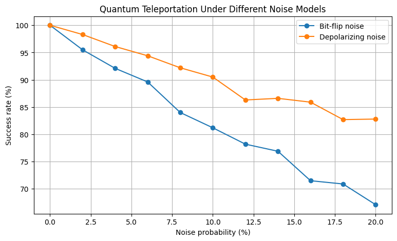
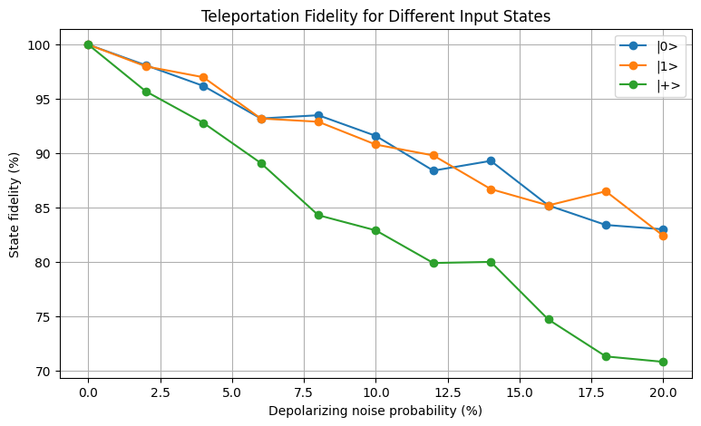

# Quantum Teleportation Under Noise

A small computational study investigating how quantum noise affects the performance and fidelity of quantum teleportation using Qiskit and Qiskit Aer.

## Overview

Quantum teleportation is a fundamental quantum communication protocol that allows an unknown quantum state to be transferred from one qubit to another using entanglement and classical communication.

This project investigates how different noise conditions affect the performance of a quantum teleportation circuit through simulation.

The study currently consists of three experiments:

1. Bit-flip noise
2. Depolarizing noise
3. Input-state dependence under depolarizing noise

---

## Research Questions

The project investigates:

- How does increasing quantum noise affect the success of quantum teleportation?
- How do different noise models affect teleportation performance?
- Does the input quantum state influence teleportation fidelity under the same noise conditions?

---

# Experiments

## Experiment 1 — Bit-Flip Noise

### Objective

To investigate how increasing bit-flip noise affects the success rate of quantum teleportation.

### Setup

- Framework: Qiskit
- Simulator: Qiskit Aer
- Number of qubits: 3
- Input state: `|0⟩`
- Shots per configuration: 1000
- Noise model: Bit-flip noise
- Noise range: 0%–20%

### Key Result

Teleportation success decreased as the bit-flip noise probability increased.

At 20% bit-flip noise, the measured teleportation success rate was **67.1%**.

See the detailed documentation:

[Experiment 1 Documentation](docs/experiment_1.md)

---

## Experiment 2 — Depolarizing Noise

### Objective

To investigate how depolarizing noise affects quantum teleportation and compare its effect with bit-flip noise.

### Setup

- Framework: Qiskit
- Simulator: Qiskit Aer
- Number of qubits: 3
- Input state: `|0⟩`
- Shots per configuration: 1000
- Noise model: Depolarizing noise
- Noise range: 0%–20%

### Key Result

Teleportation success generally decreased as the depolarizing noise parameter increased.

At 20% depolarizing noise, the measured success rate was **82.8%**.

Under the noise parameterization used in this simulation, the depolarizing-noise experiment produced higher measured success rates than the bit-flip-noise experiment across the tested range.

See the detailed documentation:

[Experiment 2 Documentation](docs/experiment_2.md)

### Noise Model Comparison



---

## Experiment 3 — Input-State Dependence

### Objective

To investigate whether the quantum state being teleported affects teleportation fidelity under increasing depolarizing noise.

Three input states were investigated:

- `|0⟩`
- `|1⟩`
- `|+⟩ = (|0⟩ + |1⟩) / √2`

### Evaluation Metric

Unlike Experiments 1 and 2, this experiment uses **quantum-state fidelity** to evaluate how closely Bob's final state matches the original input state.

A fidelity of **1** represents a perfect match between the teleported state and the target state.

### Key Result

Under the simulated circuit and noise configuration, the `|+⟩` input state exhibited lower teleportation fidelity than the computational-basis states `|0⟩` and `|1⟩` as the depolarizing-noise parameter increased.

At 20% depolarizing noise:

| Input State | Fidelity |
|---|---:|
| `\|0⟩` | 83.0% |
| `\|1⟩` | 82.4% |
| `\|+⟩` | 70.8% |

### Fidelity Comparison



See the detailed documentation:

[Experiment 3 Documentation](docs/experiment_3.md)

---

# Overall Findings

The experiments currently show three main observations:

1. **Increasing noise generally reduces teleportation performance.**

2. **Different noise models produce different levels of degradation** under their respective parameterizations.

3. **The input quantum state can influence teleportation fidelity** under a given noise configuration. In particular, the `|+⟩` state showed lower fidelity than `|0⟩` and `|1⟩` in the tested depolarizing-noise simulations.

These observations are based on simulated quantum circuits and should not be interpreted as direct measurements of physical quantum hardware.

---

# Tools & Technologies

- Python
- Qiskit
- Qiskit Aer
- NumPy
- Matplotlib
- Qiskit Quantum Information tools

---

# Project Structure

```text
Quantum_Teleportation_Noise_Study/
│
├── README.md
│
├── docs/
│   ├── experiment_1.md
│   ├── experiment_2.md
│   └── experiment_3.md
│
├── results/
│   ├── distribution_0_percent.png
│   ├── distribution_10_percent.png
│   ├── distribution_20_percent.png
│   ├── QC_Success vs Bit_Flip_Noise.png
│   ├── noise_model_comparison.png
│   └── input_state_fidelity.png
│
└── experiment_1_bit_flip_noise.ipynb
```

---

# Limitations

- The experiments were performed using simulated quantum circuits rather than physical quantum hardware.
- The study currently investigates a limited set of input states.
- Only selected noise models have been investigated.
- Results are subject to statistical fluctuations from finite-shot simulations.
- Noise parameters from different noise models should not automatically be interpreted as equivalent physical error probabilities.
- The conclusions are specific to the circuit structure and noise configuration used in these experiments.

---

# Future Work

Possible extensions of the project include:

- Testing additional quantum noise models.
- Investigating arbitrary single-qubit input states.
- Studying the effect of noise on individual gates.
- Increasing the number of shots to reduce statistical fluctuations.
- Comparing different quantum error-mitigation techniques.
- Testing the teleportation circuit on real quantum hardware.
- Investigating how different teleportation circuit implementations respond to noise.

---

# Author

**Om Waghmare**

This repository documents a computational study of quantum teleportation and the effects of simulated quantum noise using Qiskit.
